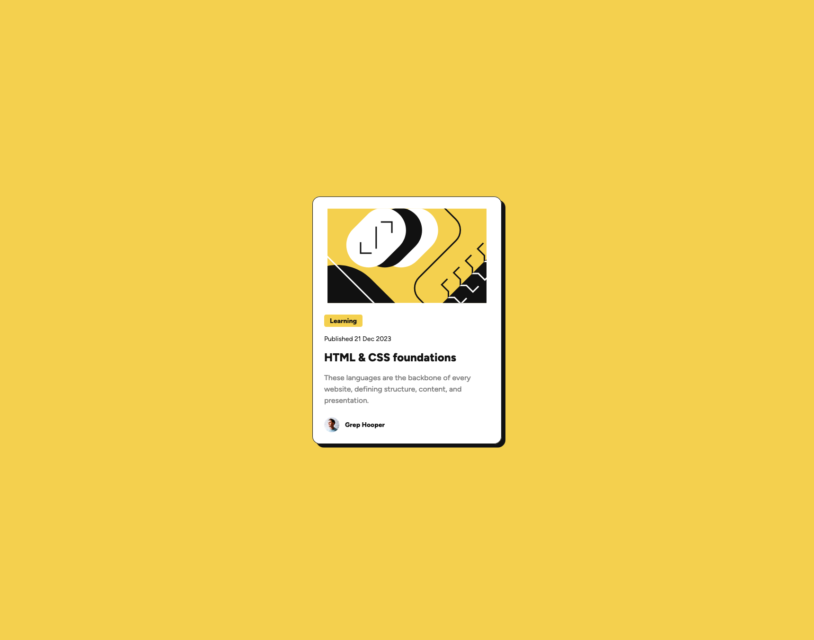

# Frontend Mentor - Blog preview card


## Frontend Mentor - Blog preview card solution

This is a solution to the [Blog preview card challenge on Frontend Mentor](https://www.frontendmentor.io/challenges/blog-preview-card-ckPaj01IcS). Frontend Mentor challenges help you improve your coding skills by building realistic projects.

## Table of contents

- [Overview](#overview)
  - [The challenge](#the-challenge)
  - [Screenshot](#screenshot)
  - [Links](#links)
- [My process](#my-process)
  - [Built with](#built-with)
  - [What I learned](#what-i-learned)
  - [Continued development](#continued-development)
  - [Useful resources](#useful-resources)
- [Author](#author)
- [Acknowledgments](#acknowledgments)

## Overview

### The challenge

Users should be able to:

- See hover and focus states for all interactive elements on the page

### Screenshot



### Links

- Live Site URL: [Blog preview card](https://your-live-site-url.com)

## My process

### Built with

- Semantic HTML5 markup
- CSS custom properties
- Flexbox
- CSS Grid
- CSS Clamp
- BEM method

### What I learned

I learned to use the clamp() mechanism better for the font-size changes. Also tried to use more utility classes.

To see how you can add code snippets, see below:

```css
.proud-of-this-css {
  .h2 {
    color: var(--clr-black);
    font-size: clamp(var(--fs-500), 5vw + 0.1rem, var(--fs-600));
    font-weight: var(--fw-800);

    transition: color var(--transition);
  }
}
```

### Continued development

My plan for now is to keep working on components rather than full page challenges. This will give me a more focused way of creating HTML thats better accesible. Also looking more in to Sass or SCSS.

### Useful resources

- [Clamp()](https://developer.mozilla.org/en-US/docs/Web/CSS/clamp) - This helped me understand clamp().
- [HTML validator](https://validator.w3.org/) - This is a great tool to validate HTML.
- [Web Accessibility Checker](https://websiteaccessibilitychecker.com/checker/index.php) - This is a great tool to validate HTML for accessibility.
- [CSS reset](https://piccalil.li/blog/a-more-modern-css-reset/) - Great blog with super helpful tips and tricks.

## Author

- GitHub - [ryanzeroseven](https://github.com/ryanzeroseven)
- Frontend Mentor - [@ryanzeroseven](https://www.frontendmentor.io/profile/ryanzeroseven)

## Acknowledgments

I watch a lot of [Kevin Powell](https://www.kevinpowell.co/) youtube videos.
